# Отчёт о лабораторной работе №6 по курсу "Основы программирования"
## Цель лабораторной работы
изучение базовых возможностей системы управления версиями, опыт работы с Git Api, опыт работы с локальным и удаленным репозиторием. 
## Ход работы
Регистрация на GitHub

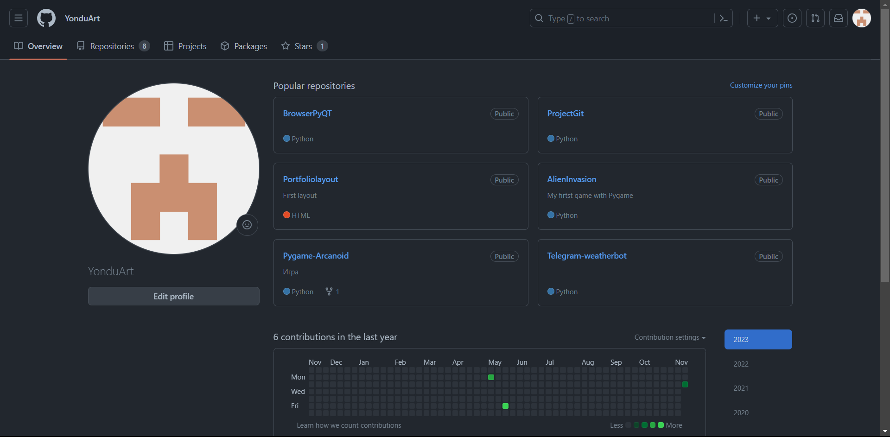

Форк репозитория

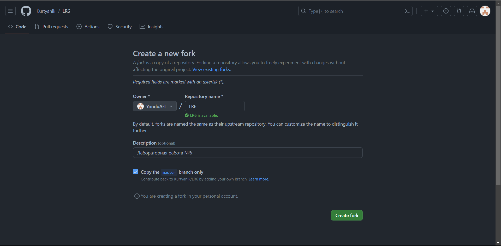

Настройка клиента git

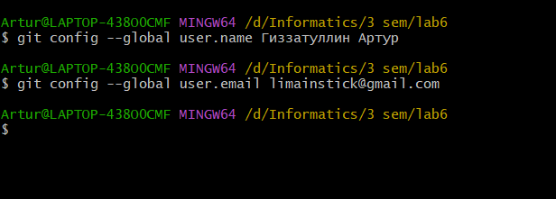

Клонирование репозитория на компьютер

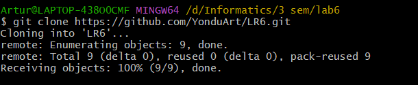

Создание файла

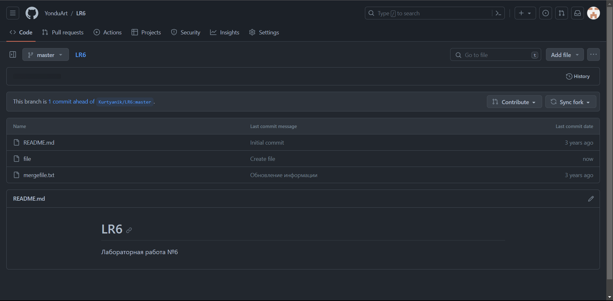

Внесение измнений в локальный репозиторий

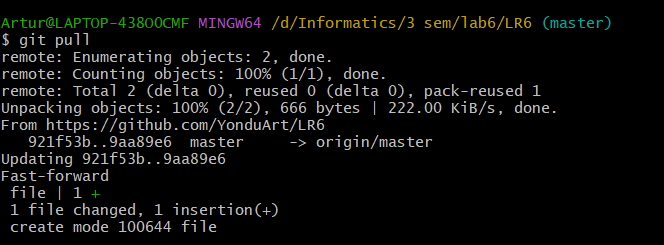
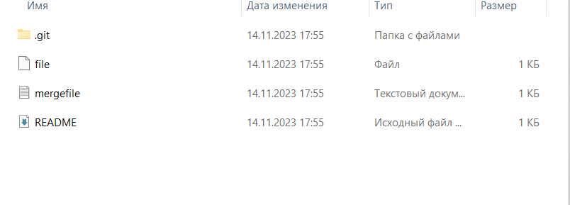

История операций для каждой ветки
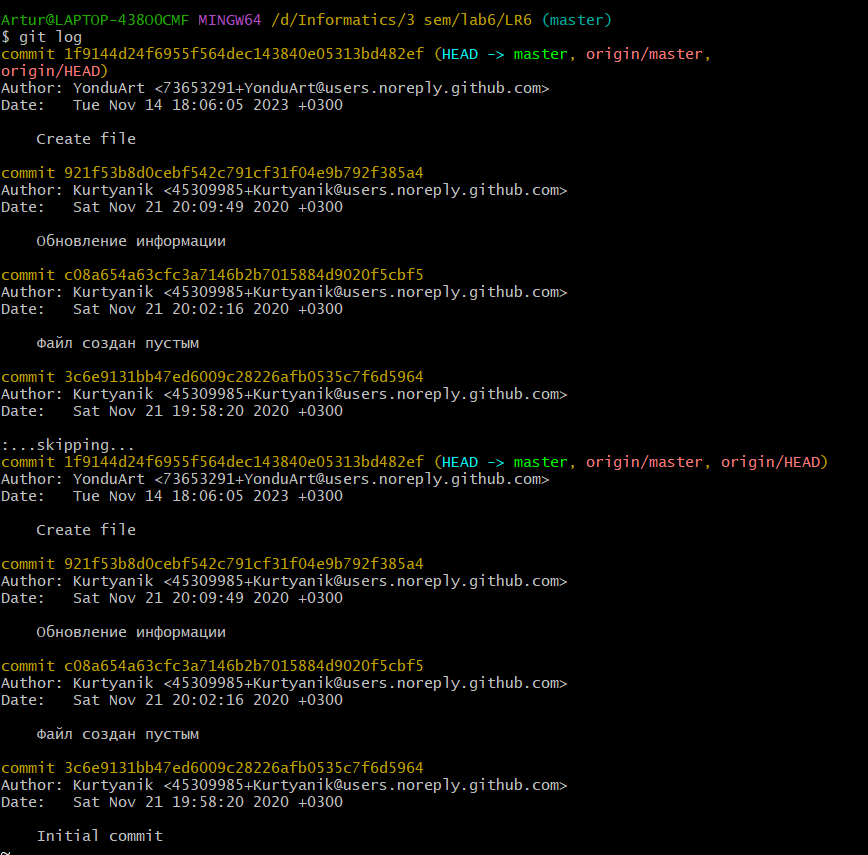
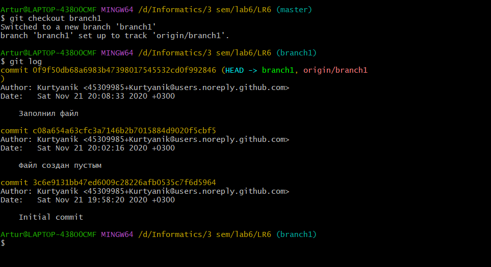

Последние изменения

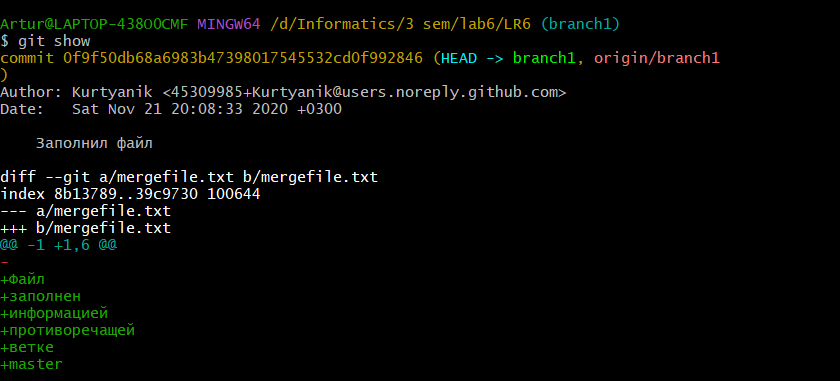
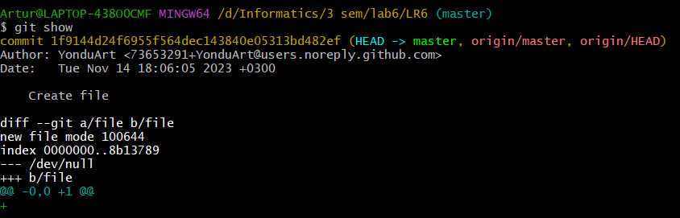

Слияние в ветку master

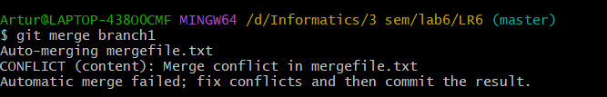

Какие были конфликты

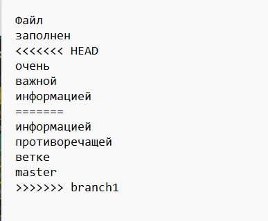

Коммит слияния

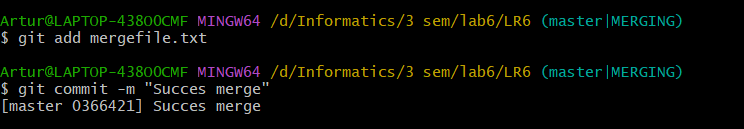

Что получилось в итоге

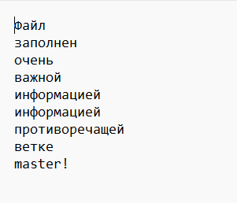

Удаление побочной ветки

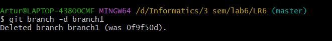
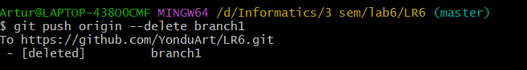

Коммиты

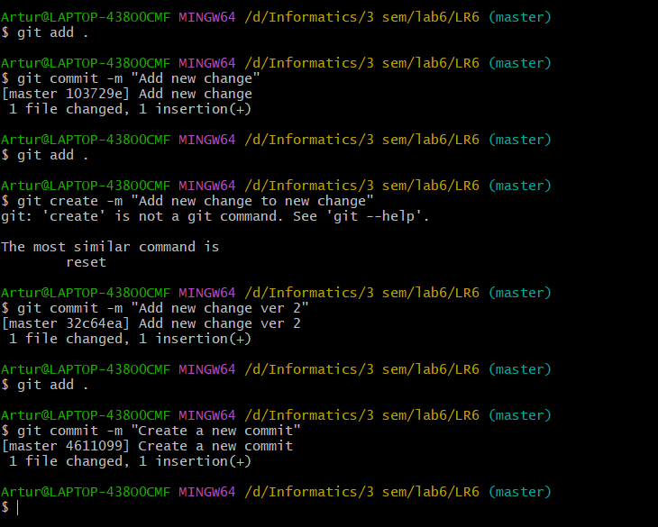

Откат последнего коммита

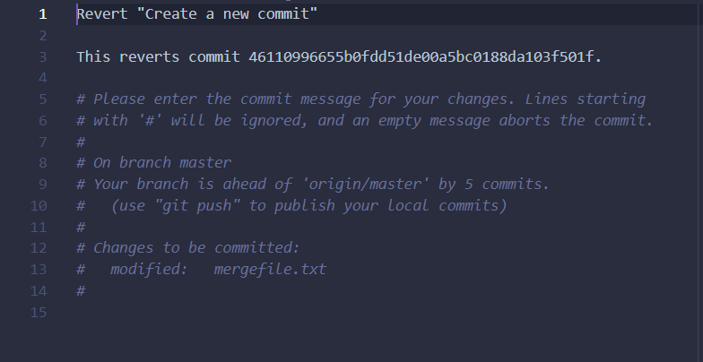

Создание ветки для отчёта

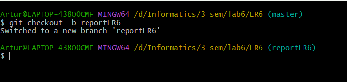

История операций в форматированном виде

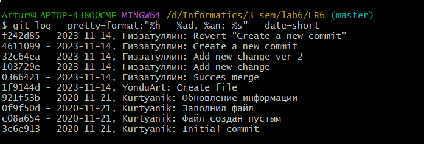

# Вывод
Изучены базовые возможности системы управления версиями, получен опыт работы с Git Api и опыт работы с локальным и удаленным репозиторием
